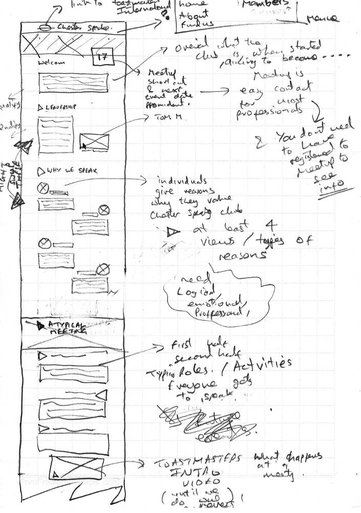
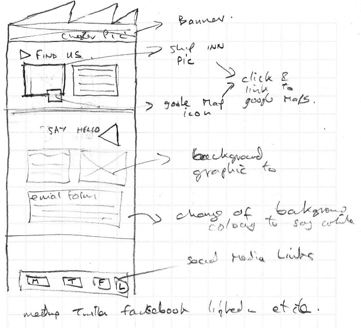
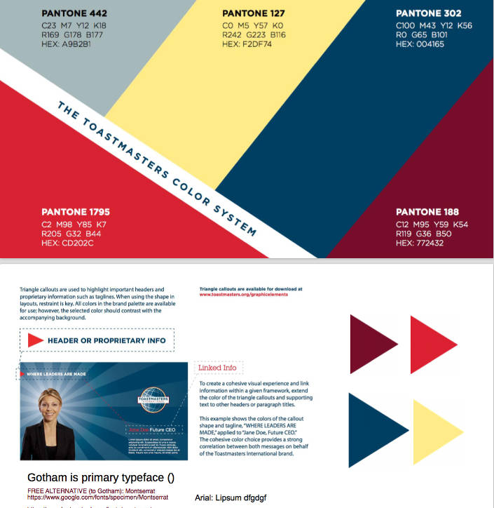
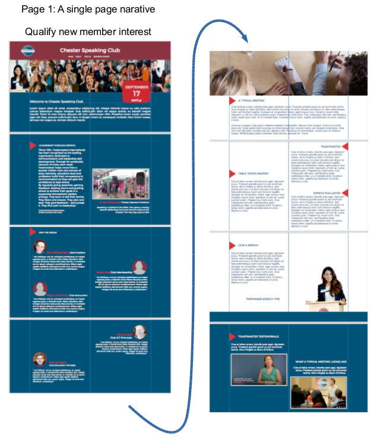
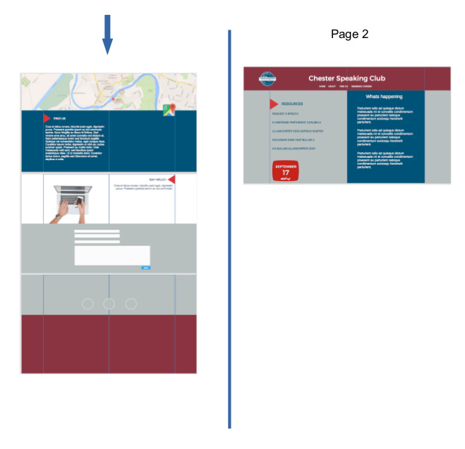
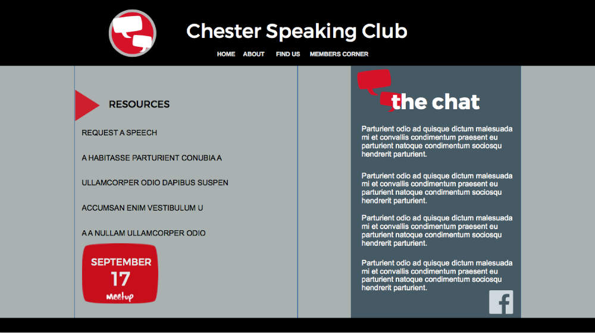
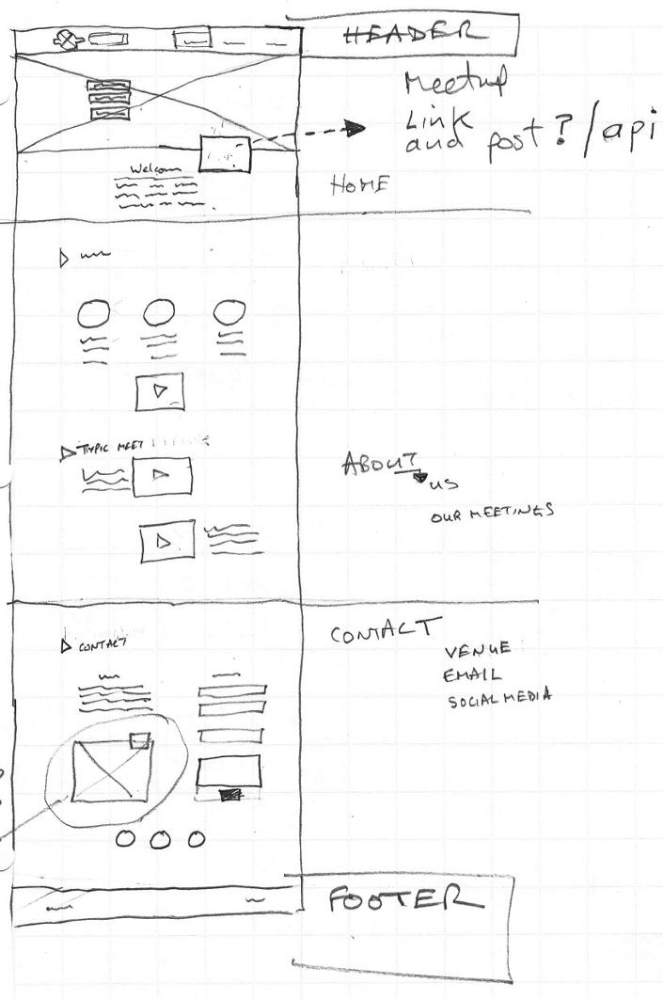

# Chester Speaking Club Website
https://appijumbo.github.io/CSC/ 

The [version used by the club](https://github.com/adminCSC/CSC) is a fork of appijumbo version, though the actual [club website](http://chesterspeaking.club) has a customised website address.

##Objective
A Toastmaster club website was to be designed and built. Toastmaster is an established international brand and its main website is a very high quality. However its membership default website that many clubs use is very dated and therefore a fresher more modern design and functionality was required.

After some consideration it was felt that a two page design, first page qualify and quantify potential new members. Second page, provide resources, news, polls or similar for the group members. 

##Design process
###1) Wireframes

Ostensibly the mobile wireframe was the same as the desktop one but employed single columns and a ‘burger’ menu. Hence although the design was ‘mobile first’ the hardest part from a design perspective was understanding how the desktop sized screen would work.

###2) Brand research 
After consulting the main Toastmaster website, [information on branding](https://www.toastmasters.org/Resources/Logos-Images-and-Templates) was found that could be directly implemented in the website design.   

Including:

  * brand Visuals – including colour schemes 

  * text – including elevator pitch with a choice of 50 or 100 words to use as main introduction

  * images – professional and freely available for Toastmaster usage

### 3) Meetup Button to Meetup’s api
A feature that dominated the design was a concept that imdeiatley anyone should see what he date of the next meetup is with an obvious link or button to the groups Meetup site provided. The date information shouldn’t be embedded in the button however, but should come from a Meetup Api.

However the exact details of this ajax api code would be left till later though from researching Meetup’s api  it was clear that [this was possible](https://www.raymondcamden.com/2015/11/20/using-the-meetup-api-in-client-side-applications/)  

However initially the date would be hard coded, ensuring the CSS worked across platforms first.

### 4) High Fidelity Design
Using the low resolution wireframe combined with the toastmasters branding, a first-order high resolution wireframe was produced.

###Brand legality considerations
 As the club is an affiliate toastmaster group, during design phase it was initially unclear if indeed the official Toastmaster brand material could be used however, so an alternative colour scheme and logo was created as a backup. 

* alternative branding using different colour palette and new logo designed
This design looked at how the 'members corner' page might work, with the key initial concept of having resources and discussions in the same place.

Eventually assurances were given that using the official brand material was acceptable.

After consultation and advice it was felt that the single page design was too long. A new wireframe was created along with a single colour blue background to enphasise simplicity and the single narrative to qualify from ‘welcome’ to ‘say hello’.

### 5) Coding the site
####Choosing a dynamic or static website - Wordpress or Jekyll
It was clear that the site would need to interact with users, thus on the face of it a dynamic website was required. However should a traditional Wordpress solution or would a more modern approach using a static site builder such as Jekyll be best? Wordpress is well established and has a customer facing platform so initially the site was developed with Wordpress in mind.

####Wordpress design

Wishing to keep code focused, a [static site](https://github.com/appijumbo/ToastStatic/tree/gh-pages) was built first, then convert to a [Wordpress version](https://github.com/appijumbo/ToastWordpress)

The final Wordpress development version requires a local Wordpress server is required such as [Mamp](https://www.mamp.info/en/downloads/).

The process to convert a static site into a Wordpress site requires many changes to the code. Ata basic level splitting the header, main part and footer into separate files and re-saving them instead of html as php formats. Furthermore various Wordpress ‘hooks’ need to be included to enable php functions.

A [bootstrap 3 theme](https://startbootstrap.com/template-overviews/freelancer/) was used as a template for building the site. However this may have been a little ‘over kill’ in hindsight. Also the theme use standard CSS and not Sass. In future a Sass orientated process is preferred simply because the bootstrap css takes more Kb to download than what is actually used on the site.

Here a good explanation for [converting a Bootstrap 3 theme to Wordpress](https://www.youtube.com/watch?v=OQY3dNHLt1I&list=PLtwuv70Lf-ZlTLcr0y9TdmcmfhzMUywsX&index=26) which considers most of these factors.

####Improving the form with UK regEx for telephone numbers
Smaller improvements included changing the RegEx expressions inside the 

####Introduction of Github and Git control

####Jekyll Design
Initial phase Very focused on finding new members.
Use formspree for email
Linking Github repo gh-pages to a custom Domain (CNAME and A record)

###To Do’s

###SEO
Chrome dev tool’s PageSpeed
https://varvy.com

###Page 2 - Membership
The club accountant has suggested that a electronic payment or some other way of filling in a form and automating the club membership should be built in the site. This would suit the second page.

##Lessons Learnt
Have implemented a far better version control system

Sass not CSS
Use Bootstrap?
In future I’ll use Gulp for minify etc
Use [Vagrant](https://www.vagrantup.com) with [Salt](https://www.vagrantup.com/docs/provisioning/salt.html) to create a better work environment for Wordpress to be developed in.

had problems managing multiple SSH accounts to interact with Github in MacOS

Beaver Builder 