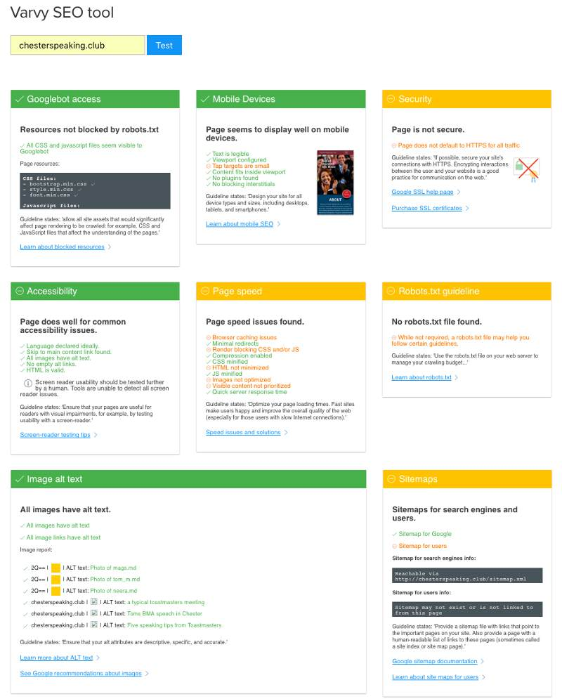
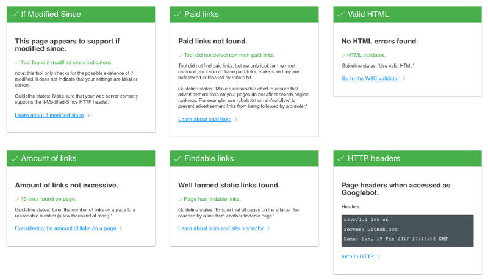

# Chester Speaking Club Website

Note: This site has recently been set aside by the club and alas, no longer has correct api keys for the meetup api to function hence the next meetup day now doesn't display on the meetup button. However the [static site](https://appijumbo.github.io/ToastStatic/) used to devlop this site gives one an idea how the button would have looked.

## Objective
A Toastmaster club website was to be designed and built. Toastmaster is an established international brand and its main website is a very high quality. However its membership default website that many clubs use is very dated and therefore a fresher more modern design and functionality was required.

After some consideration it was felt that a two page design, first page qualify and quantify potential new members. Second page, provide resources, news, polls or similar for the group members. 

## Design process
### 1) Wireframes

Ostensibly the mobile wireframe was the same as the desktop one but employed single columns and a ‘burger’ menu. Hence although the design was ‘mobile first’ the hardest part from a design perspective was understanding how the desktop sized screen would work.

<a href="./design_Info/toastmaster wireframe 1_.jpg">wireframe design part 1</a>

<a href="./design_Info/toastmaster wireframe 2_.jpg">wireframe design part 2</a>

### 2) Brand research 
After consulting the main Toastmaster website, [information on branding](https://www.toastmasters.org/Resources/Logos-Images-and-Templates) was found that could be directly implemented in the website design.   

Including:

  * brand Visuals – including colour schemes 

#### brand manual visuals

  * text – including elevator pitch with a choice of 50 or 100 words to use as main introduction

  * images – professional and freely available for Toastmaster usage

### 3) Meetup Button to Meetup’s api
A feature that dominated the design was a concept that imdeiatley anyone should see what he date of the next meetup is with an obvious link or button to the groups Meetup site provided. The date information shouldn’t be embedded in the button however, but should come from a Meetup Api.

However the exact details of this ajax api code would be left till later though from researching Meetup’s api  it was clear that [this was possible](https://www.raymondcamden.com/2015/11/20/using-the-meetup-api-in-client-side-applications/)  

However initially the date would be hard coded, ensuring the CSS worked across platforms first.

### 4) High Fidelity Design
Using the low resolution wireframe combined with the toastmasters branding, a first-order high resolution wireframe was produced.

### Brand legality considerations
 As the club is an affiliate toastmaster group, during design phase it was initially unclear if indeed the official Toastmaster brand material could be used however, so an alternative colour scheme and logo was created as a backup. 

* alternative branding using different colour palette and new logo designed
This design looked at how the 'members corner' page might work, with the key initial concept of having resources and discussions in the same place.

Alternative Branding - Early members page concept

Eventually assurances were given that using the official brand material was acceptable.

After consultation and advice it was felt that the single page design was too long. A new wireframe was created along with a single colour blue background to enphasise simplicity and the single narrative to qualify from ‘welcome’ to ‘say hello’.

### 5) Coding the site
#### Choosing a dynamic or static website - Wordpress or Jekyll
It was clear that the site would need to interact with users, thus on the face of it a dynamic website was required. However should a traditional Wordpress solution or would a more modern approach using a static site builder such as Jekyll be best? Wordpress is well established and has a customer facing platform so initially the site was developed with Wordpress in mind.

#### Wordpress design

Wishing to keep code focused, a [static site](https://github.com/appijumbo/ToastStatic/tree/gh-pages) was built first, then convert to a [Wordpress version](https://github.com/appijumbo/ToastWordpress)

The final Wordpress development version requires a local Wordpress server is required such as [Mamp](https://www.mamp.info/en/downloads/).

The process to convert a static site into a Wordpress site requires many changes to the code. At a basic level splitting the header, main part and footer into separate files and re-saving them instead of html as php formats. Furthermore various Wordpress ‘hooks’ need to be included to enable php functions.

A [bootstrap 3 theme](https://startbootstrap.com/template-overviews/freelancer/) was used as a template for building the site. However this may have been a little ‘over kill’ in hindsight. Also the theme use standard CSS and not Sass. In future a Sass orientated process is preferred simply because the bootstrap css takes more Kb to download than what is actually used on the site.

Here a good explanation for [converting a Bootstrap 3 theme to Wordpress](https://www.youtube.com/watch?v=OQY3dNHLt1I&list=PLtwuv70Lf-ZlTLcr0y9TdmcmfhzMUywsX&index=26) which considers most of these factors.

#### Improving the Contact Form
Smaller improvements included changing the RegEx expressions inside the contact form along with the messages giving feedback as the user types in information.  

#### Git and Github for Web Dev Newbiee Guide
After the Wordpress version was created a particular frustration was the need to easily show code to prospective parties and document the development. It was clear that Git and Github should be integral to project mangement, hence time was spent learning git and Github. 

Consequently having done some short courses, including the [Github for Developers course](https://services.github.com/training/) I [produced a document](https://github.com/appijumbo/Git-Github-for-Newbies) to reflect what I learned, capturing Git and Github under one roof. It it hoped this this will be improved and ammended overtime

#### Jekyll Design
Having created a wordpress website and learned some Git and using Github. After discussions with other devs and bearing in mind that the initial first phase was very focused on finding new members, so as such dosn't change much ie static, I decided to create the [Toastmasters website as a Jekyll page](https://github.com/appijumbo/CSC).

This course by [Thomas Bradley](https://www.youtube.com/watch?v=oiNVQ9Zjy4o&index=4&list=PLtwuv70Lf-Zn4b05TlJIqPRn1dEPS78fO) prvoides a good basis for building Jekyll website.

There were some good benifits from using Jekyll namley the clubs details could be contained in a config file such that it would be quite easy for another club to use without having to go through every line of code plus the ease of creating a site via Gihub pages and cutomising its domain.

The one issue that croped up was the need to get information from a form to be sent via email. The code was designed for php, ie a dynamic site. However this is a common problem and one of the solutions is to use a service such as [formspree](https://formspree.io) for email. Formspree is free under a 1000 submissions a month withich is massivley more than a typical club would expect (typically we would expect say 10 per month)

Moreover by linking Github repo gh-pages to a custom Domain by setting a CNAME file in the Github repo and an A record for github site in the purchased site domain. Thus from a user perspective they are unaware that its a github site.

## To Do’s

### Search Engine Optimisation (SEO)
Using chrome dev tool’s PageSpeed some SEO has been done. However browser caching, specifying a cache validator, minifying HTML & JS needs to be done. Current score is 90/100.

Additionaly the [Varvy](https://varvy.com) SEO tool was also employed. 

In addition to PageSpeed this identified the need to switch to all HTTPS, the use of Sitemaps and robots.txt on the site as well as the tap area when in mobile usage being a little too small.

All these issues need to be acted on.

### Phase II
The club accountant has suggested that a electronic payment or some other way of filling in a form and automating the club membership should be built in the site. This would suit being included in a second page.

Hence subsequent pages should perhaps include

  * A membership signing Form, possibly done through say [Stripe](https://stripe.com/gb)
  
  * Resource links e.g. videos, articles from [Medium](https://medium.com) 
  
  * Polling for group concensous
  
  * Facebook link for News
  
  * A [Disqus](https://disqus.com) discussion forum
  
  * The roles for upcoming meetings are indicated as available, or whom is taking them. This should be simple
  
  * Add client-side support such as [Forestry](https://forestry.io) or [CloudCannon](http://cloudcannon.com). It would be nice to experiment with siting up the site to use one of these in the hope that it will make it easier to use and adapt for more people.
  

## Lessons Learnt

### Git and Github
The biggest impact was implementing git and Github in my workflow. Once the basics of git had been grasped only occasionly did I need to 'rebase' or use some other more complicated git-flow. 
I vhave been expermenting using the git GUI in Brackets my current text editor of choice. 
Whilst I have found the Brackets git GUI usefull I've found the command line still is superior.

Describing the development of the code for future reference as a README or in a Wiki has proven extreemly usefull and I would like to use this more in future project development.

One slight issue was using Git with Jekyll. One needs to be carefull about the _site folder that re-builds itself when the site is being driven by the Jekyll server command. The local .gitignore directory needs to contain _site or similar. A little more work is needed to sort this issue out, however I have manged to work around it for the time being.

### Sass not CSS
In future I would much prefer to use Sass and not CSS (unless its very simple CSS).
I find the need to import the whole CSS in from Bootstrap quite an overkill, though Bootstrap 4 supports Sass its not quite ready yet. Alternitivley I may well use [Bourbon, Neat, Bitters and Refills](http://bourbon.io) which offer an alternative to the Bootstrap approach.

### Gulp
One of the problems I found during the SEO was the need to minify CSS, JS and HTML. Unfortunatly I hadn't set myself up with a build tool and had to use online minifying tools and similar.

In future I’ll use [Gulp](http://gulpjs.com) for [minifying and other needs such as optimising images](https://css-tricks.com/gulp-for-beginners/) (I did this individualy using Gimp for this site). 

### Multiple Github accounts and switching to a Linux desktop
One major frustration was that having multiple Github accounts did repeatdly cause password key access problems. I havn't yet got a complete solution, and had to hand manage my password system quite a lot. Ideally I can find a better solution in future. Perhaps switchinfg to Linux may help because I can more easily manage SSH.

### Future Worpress sites
#### Docker Vagrat and Salt
I intend to use docker or [Vagrant](https://www.vagrantup.com) with [Salt](https://www.vagrantup.com/docs/provisioning/salt.html) to create a better work environment for any future Wordpress sites to be developed in. This will isolate each wordpress develpment and should create a 'within a single disposable, consistent environment..'

#### Beaver Builder, Page Builder by SiteOrigin
This is a GUI development tool for Wordpress. It allows site development with minimal coding. This may be the best option for Worpress development, however it costs approch £100. UPdate: With hindsight [sightOrigin's page builder](https://en-gb.wordpress.org/plugins/siteorigin-panels/) which is free I belive may be a good alternative.

### Future Jekyll sites
#### Client Side Support
At the moment the Jekyll code requires someone who is reasonably tech savvy. However many people are familiar with the Wordpress client side GUI access that make Wordpress easier to change. 
There are a growing number of companies that a client-side GUI access to Jekyll for example [Forestry](https://forestry.io) or [CloudCannon](http://cloudcannon.com).

It would be nice to experiment with siting up the site to use one of these in the hope that it will make it easier to use and adapt for more people.
